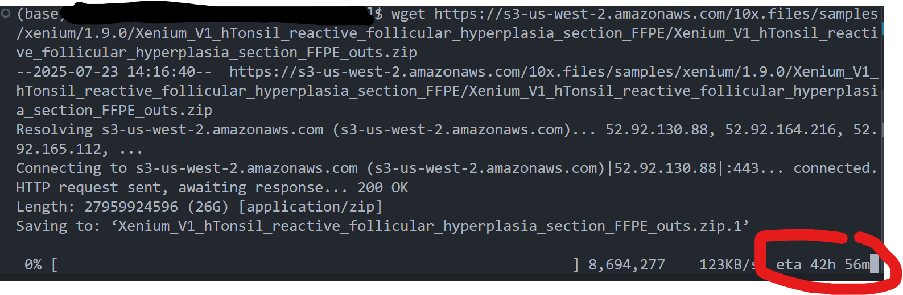
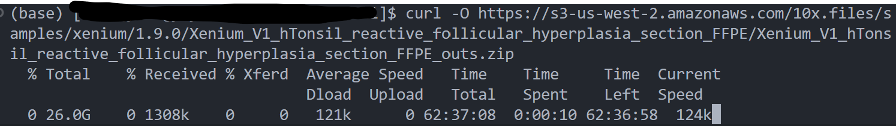
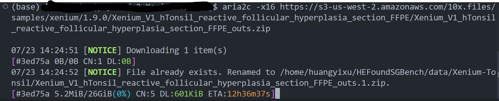

# 高速下载工具

这篇文章中，我将介绍我在实践过程中使用的好用的下载工具，希望能够帮到你！

## 包下载
我们知道，如果你使用 anaconda 或者 miniconda 作为包管理的工具，环境中下载包有两个常见的方法。
- `conda install <package_name>` （例如：`conda install numpy`）  
- `pip install <package_name>` （例如：`pip install pandas`）

但是，即使你使用了镜像源，有时候下载速度仍然非常慢。举个例子，我在打 Kaggle 的时候下载 vllm 这个包时使用 `pip install vllm` 命令就非常缓慢。这时候，有什么替代方案吗？

### `uv pip`
**uv pip** 是一个由 Rust 开发的高性能包管理工具，旨在加速 Python 包的下载和安装。它通过并行下载和优化的依赖解析显著提升效率，特别适合需要快速安装大量包的场景。

**下载和使用方式：**
1. 安装 uv：可以通过 `pip install uv` 安装，或者从 [官方 GitHub 仓库](https://github.com/astral-sh/uv) 下载最新版本。
2. 使用方式：替换 `pip` 命令，例如 `uv pip install vllm`，即可享受更快的下载速度。
3. 高效性：uv pip 支持多线程下载和缓存优化，通常比传统 `pip` 快 2-10 倍，尤其在下载大包或复杂依赖时效果显著。

### `pixi`
**pixi** 是一个现代化的包管理工具，专注于跨平台和高效的包管理，支持 Python 和其他语言的包。它集成了类似 conda 的环境管理功能，同时提供更快的下载速度和更简单的命令行界面。

**下载和使用方式：**
1. 安装 pixi：从 [pixi 官网](https://pixi.sh/) 下载适用于你的操作系统的二进制文件，或通过 `curl -fsSL https://pixi.sh/install.sh | sh` 安装。
2. 使用方式：创建并激活环境后，使用 `pixi install <package_name>`（例如：`pixi install numpy`）来安装包。
3. 高效性：pixi 使用优化的下载通道和缓存机制，下载速度通常比 conda 快，且支持并行任务，适合快速搭建开发环境。

## 网络下载

比较普遍，也是大家第一个会接触的工具应该就是 wget 了。然而，wget 的下载效率，确实不太行，我甚至经常卡在还没开始下载的 Reading Web Response 阶段。

当然，也有 curl 下载的方法。**curl** 是一个功能强大的命令行工具，用于通过 HTTP、FTP 等协议下载文件，但其单线程下载方式在面对大文件或慢速网络时效率较低，下载速度常常不尽如人意。

### aria2
**aria2** 是一个轻量级、多协议的下载工具，支持 HTTP、FTP、BitTorrent 等协议。它通过多线程和分段下载显著提升下载速度，特别适合大文件和不稳定的网络环境。

**下载和使用方式：**
1. 安装 aria2：
   - Linux：`sudo apt-get install aria2`（Ubuntu/Debian）或 `sudo yum install aria2`（CentOS）。
   - macOS：`brew install aria2`。
   - Windows：从 [aria2 GitHub 页面](https://github.com/aria2/aria2) 下载二进制文件。
2. 使用方式：运行 `aria2c <URL>`，可以添加参数如 `-x 16`（最多 16 个连接）或 `-s 16`（分 16 段下载）以提高速度，例如：`aria2c -x 16 -s 16 https://example.com/largefile.zip`。
3. 高效性：aria2 支持多源下载和断点续传，下载速度可比 wget 和 curl 快数倍，特别是在高带宽或多服务器场景下。

### axel
**axel** 是一个轻量级的命令行下载工具，专注于通过多线程下载加速 HTTP 和 FTP 文件的下载。它简单易用，适合快速下载大文件。

**下载和使用方式：**
1. 安装 axel：
   - Linux：`sudo apt-get install axel`（Ubuntu/Debian）或 `sudo yum install axel`（CentOS）。
   - macOS：`brew install axel`。
   - Windows：从 [axel GitHub 页面](https://github.com/axel-download-accelerator/axel) 下载二进制文件。
2. 使用方式：运行 `axel <URL>`，可通过 `-n <num>` 指定连接数，例如：`axel -n 10 https://example.com/largefile.zip`。
3. 高效性：axel 通过多线程分段下载大幅提升速度，通常比 wget 快 2-5 倍，且资源占用低，适合服务器环境。

Ps. 因为我是使用的导师的服务器，没有管理员权限，这里不展示 axel 的下载效果。

希望可以为大家带来参考！